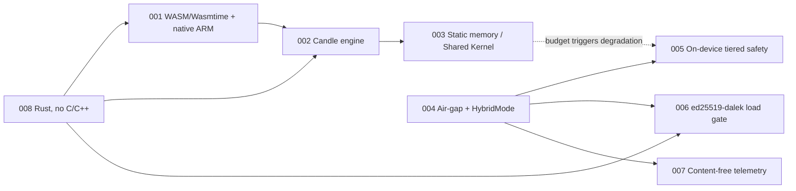

# Architecture Decision Records

Significant, hard-to-reverse architectural decisions for the Edge-Native LLM SDK,
derived from [`docs/prd.md`](../prd.md) and the DDD model in
[`docs/ddd/`](../ddd/README.md). The SDK is implemented in **Rust** (no C/C++ —
see ADR-008). Each ADR is registered in AgentDB (semantic tier) and searchable in
the `adr-patterns` namespace.

| ADR | Title | Status | Tags |
|-----|-------|--------|------|
| [001](./ADR-001-adopt-webassembly-as-cross-platform-sdk-runtime.md) | WebAssembly (Wasmtime) as the portable target, alongside native ARM | accepted | runtime, wasm, rust, core |
| [002](./ADR-002-candle-as-rust-native-inference-engine.md) | Candle as the Rust-native inference engine | accepted | runtime, candle, rust, core |
| [003](./ADR-003-static-memory-planning-with-zero-allocation-arena.md) | Static memory planning with a zero-allocation arena (Runtime↔Memory Shared Kernel) | accepted | memory, shared-kernel, core |
| [004](./ADR-004-air-gapped-by-default-with-opt-in-hybrid-mode.md) | Air-gapped by default with opt-in local-network HybridMode | accepted | privacy, networking, invariant |
| [005](./ADR-005-on-device-only-tiered-decoder-time-safety.md) | On-device-only, tiered decoder-time safety (no cloud moderation) | accepted | safety, compliance, supporting |
| [006](./ADR-006-mandatory-ed25519-model-signature-verification-load-gate.md) | Mandatory ED25519 model-signature verification as a hard load gate | accepted | security, provenance, generic |
| [007](./ADR-007-content-free-domain-events-privacy-by-construction-telemetry.md) | Content-free domain events for privacy-by-construction telemetry | accepted | privacy, telemetry, generic |
| [008](./ADR-008-implement-the-sdk-in-rust-instead-of-c-cpp.md) | Implement the SDK in Rust instead of C/C++ | accepted | language, rust, foundational |

## Decision relationships

> **ADR-008 is foundational** (the language decision) and drives the revisions to
> ADR-001 and ADR-002. It carries a higher number only because it was recorded
> after the initial C++-assuming set; ordering is chronological, not by
> importance.

## Conventions

- **Numbering**: sequential `ADR-NNN`, never reused.
- **Status lifecycle**: `proposed → accepted → (deprecated | superseded by ADR-MMM)`.
- **New ADRs**: run `/ruflo-adr:adr-create`. Rebuild the AgentDB graph with
  `/ruflo-adr:adr-index`. Check code against decisions with `/ruflo-adr:adr-review`.
