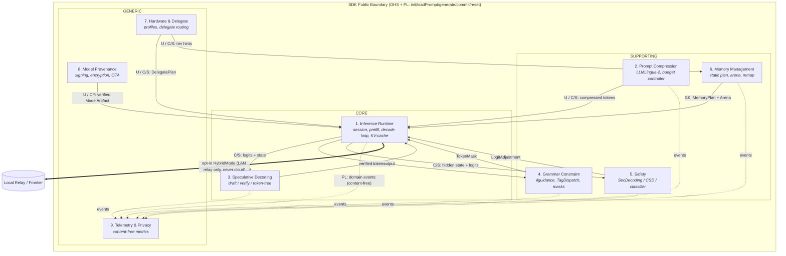

# Context Map

> Nine bounded contexts derived from [`docs/prd.md`](../prd.md), and the strategic
> relationships between them. Relationship vocabulary follows Evans/Vernon:
> **U** = upstream, **D** = downstream, **OHS** = Open Host Service, **PL** =
> Published Language, **ACL** = Anti-Corruption Layer, **C/S** =
> Customer/Supplier, **CF** = Conformist, **SK** = Shared Kernel.

## Map diagram

## External libraries wrapped behind ACLs

The SDK is pure **Rust** (see `docs/adr/ADR-008`); these are the Rust crates (and
the OS APIs reached via thin FFI) that each context wraps. None of their types
may cross into the domain — each owning context exposes a port and an ACL.

| External (Rust crate / OS API) | Wrapped by (context) | ACL translates |
|--------------------------------|----------------------|----------------|
| **Candle** (GGUF/safetensors, quantized kernels, Metal) | Inference Runtime + Hardware & Delegate | model graph, delegate dispatch, tensors |
| **tract** (pure-Rust ONNX, optional) | Inference Runtime | ONNX node graph → `GraphOp` |
| **LLMLingua-2** classifier on Candle (BERT/XLM-R) | Prompt Compression | token-keep classification → segment decisions |
| **llguidance** (Rust constrained decoding) | Grammar Constraint | grammar compile / token mask |
| SecDecoding base+safety models on Candle | Safety | divergence → logit adjustment |
| `wgpu` (WebGPU); `ndk`/`objc2` FFI to NNAPI/QNN/CoreML (optional) | Hardware & Delegate | delegate capability + dispatch |
| **Wasmtime** runtime + `wasm-bindgen`/UniFFI bindings | Inference Runtime | module load, linear-memory / host-call binding |
| `ed25519-dalek` (RustCrypto); platform keystore via FFI | Model Provenance | signature → verification verdict |
| `memmap2` (zero-copy weight mapping) | Memory Management | mapped pages → arena `Tensor` |

## Relationship rationale

- **Model Provenance → Inference Runtime (Conformist).** The runtime will not
  load an artifact that provenance has not verified. The runtime conforms to the
  provenance verdict; there is no negotiation — a failed signature is a hard stop.
- **Hardware & Delegate → Inference Runtime / Memory (Customer/Supplier).** The
  delegate plan and tier hints are produced upstream by capability detection;
  the runtime and memory planner are customers and state their needs (e.g. "KV
  in SRAM if possible"), but cannot invent hardware that isn't present.
- **Memory Management ↔ Inference Runtime (Shared Kernel).** The arena layout
  and tensor-descriptor model are co-owned: the decode loop and the planner must
  agree on offsets and the zero-allocation invariant. Changes are made jointly.
- **Prompt Compression → Inference Runtime (Customer/Supplier).** Compression
  runs before prefill and hands over a shorter token stream. The runtime is the
  customer; compression is degradable (can be disabled under memory pressure).
- **Decode-loop collaborators (Speculative / Grammar / Safety).** Each step the
  Inference Runtime is the *customer*: it asks Grammar for a mask, Safety for a
  logit adjustment, and Speculative Decoding for verified tokens, then composes
  them. These three are independent of one another and never call each other.
- **All contexts → Telemetry (Published Language, one-way).** Telemetry
  subscribes to content-free domain events. No context depends on Telemetry, and
  Telemetry depends on no context's internals — this keeps the privacy invariant
  structurally enforced.

## Invariants that span the whole map

1. **No network egress** except the optional, explicitly opt-in `HybridMode`
   port on the Inference Runtime — and that port reaches a LAN relay only, never
   a cloud API.
2. **No vendor type crosses a context boundary** — only the ACL-translated
   domain types in [`ubiquitous-language.md`](./ubiquitous-language.md).
3. **No prompt or response content reaches Telemetry** — events carry counters
   and identifiers only.
4. **No heap allocation inside the decode loop** — guaranteed by the shared
   Memory Plan.
