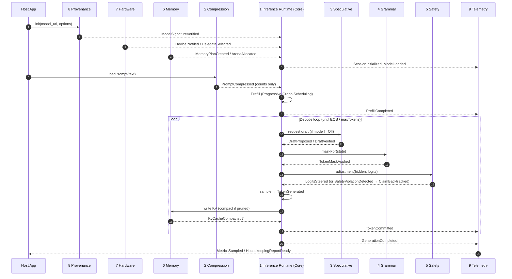

# Domain Events Catalog

> Every domain event across the nine bounded contexts, the request → token flow
> that emits them, and the privacy rule all events obey. Source: synthesized
> from [`docs/prd.md`](../prd.md) and the per-context models.

## Naming & schema rules

- **Past tense.** Events record facts that already happened (`PrefillCompleted`,
  not `CompletePrefill`).
- **Content-free.** No event field may contain prompt/response text or any
  user-derived content — only ids, counts, scores, timings, enums. This is what
  makes the Telemetry context's privacy guarantee structural (see
  [context 9](./bounded-contexts/09-telemetry-privacy.md)).
- **Correlated by `SessionId`.** Every event carries the owning `SessionId` (and
  a logical step index where relevant) so Telemetry can fold them without
  payloads.
- **Standard envelope:** `{ eventName, sessionId, occurredAtStep, payload }`
  where `payload` holds only the typed fields listed below. (No wall-clock is
  assumed in the model — ordering is by `occurredAtStep`.)

## Catalog by publishing context

### 1. Inference Runtime (Core)
| Event | Payload (content-free) | Meaning |
|-------|------------------------|---------|
| `SessionInitialized` | sessionId, runtimeKind, deviceTarget, safetyMode, speculationMode | `init()` succeeded |
| `ModelLoaded` | modelId, modelVersion, format | model mapped & ready |
| `PrefillCompleted` | promptTokenCount, kvLength, prefillTps | KV-cache built |
| `TokenGenerated` | stepIndex, sampled:bool | a token chosen this step |
| `TokenCommitted` | stepIndex, kvLength | token appended to KV |
| `GenerationCompleted` | totalTokens, stopReason (`Eos`/`MaxTokens`/`Stopped`) | loop ended |
| `SessionReset` | sessionId | KV/activations cleared |
| `HybridRelayConsulted` | relayId | opt-in LAN relay used |

### 2. Prompt Compression (Supporting)
| Event | Payload | Meaning |
|-------|---------|---------|
| `PromptCompressed` | inputTokens, outputTokens, ratio, classifierMs | trimming done |
| `CompressionSkipped` | reason (`Disabled`/`MemoryPressure`) | compression bypassed |

### 3. Speculative Decoding (Core-adjacent)
| Event | Payload | Meaning |
|-------|---------|---------|
| `DraftProposed` | stepIndex, draftLength | candidate tokens proposed |
| `DraftVerified` | stepIndex, acceptedCount, firstRejectIndex | verify pass result |
| `DraftAccepted` | stepIndex, acceptedCount | ≥1 draft committed |
| `DraftRejected` | stepIndex | all drafts rejected |
| `SpeculationDisabled` | reason (`MidRangeProfile`/`MemoryPressure`) | downgraded to sequential |

### 4. Grammar Constraint (Supporting)
| Event | Payload | Meaning |
|-------|---------|---------|
| `GrammarRegistered` | grammarId | schema registered |
| `GrammarCompiled` | grammarId, jit:bool | FSM ready (precompiled or JIT) |
| `GrammarSwitched` | stepIndex, fromStateId, toStateId | tag matched, sub-grammar pushed/popped |
| `TokenMaskApplied` | stepIndex, allowedCount | mask applied before sampling |
| `GrammarViolationBlocked` | stepIndex | an illegal token was masked out |

### 5. Safety (Supporting)
| Event | Payload | Meaning |
|-------|---------|---------|
| `SafetyModeSelected` | mode, downgradedFrom? | affordable mode chosen |
| `LogitsSteered` | stepIndex, adjustmentNorm | SecDecoding adjustment applied |
| `SafetyViolationDetected` | stepIndex, score, threshold | content exceeded threshold |
| `ClaimBacktracked` | claimIndex, score | CSD rewind + resample |
| `SafetyDisabled` | reason | downgraded for memory |

### 6. Memory Management (Supporting / Shared Kernel)
| Event | Payload | Meaning |
|-------|---------|---------|
| `MemoryPlanCreated` | planId, totalBytes, sramBytes, dramBytes | static plan computed |
| `ArenaAllocated` | bytes, pageAligned:bool | contiguous arena reserved |
| `KvCacheCompacted` | reclaimedDescriptors | descriptor-only shuffle |
| `MemoryBudgetExceeded` | requestedBytes, budgetBytes | triggers feature downgrade / flash spill |
| `HighWaterMarkSampled` | bytes | peak usage sample |

### 7. Hardware & Delegate (Generic)
| Event | Payload | Meaning |
|-------|---------|---------|
| `DeviceProfiled` | profileKind, ramBytes, bandwidthGbs, npuTops, delegates[] | capabilities resolved |
| `DelegateSelected` | planId, partitionCount, delegates[] | graph partition assigned |
| `DelegateFellBack` | fromDelegate, toDelegate | accelerator unavailable → fallback |
| `DelegateHotPlugged` | newDelegate | faster delegate became available mid-session |

### 8. Model Provenance (Generic)
| Event | Payload | Meaning |
|-------|---------|---------|
| `ModelSignatureVerified` | modelId, modelVersion, publicKeyId | load gate passed |
| `ModelSignatureRejected` | modelId, reason | hard stop — no load |
| `ModelUpdateApplied` | modelId, fromVersion, toVersion | OTA swap succeeded |
| `ModelUpdateRejected` | updateId, reason | update refused, current kept |

### 9. Telemetry & Privacy (Generic)
| Event | Payload | Meaning |
|-------|---------|---------|
| `MetricsSampled` | snapshotId, throughput, latency, highWaterMark | snapshot folded |
| `HousekeepingReportReady` | totalTokens, peakBytes | aggregate report available |

## End-to-end event flow (happy path)

## Decode-step composition order (invariant)

Within a single decode step the orchestrator composes collaborators in a fixed
order — this ordering is itself a domain rule:

1. **Draft** (Speculative, optional) → candidate tokens.
2. **Verify** on the target model → always at least the next token.
3. **Grammar mask** (`TokenMaskApplied`) → zero out illegal tokens.
4. **Safety adjust** (`LogitsSteered`) → subtract the logit adjustment.
5. **Sample / greedy** → `TokenGenerated`.
6. **Commit** → write KV, compact if needed → `TokenCommitted`.

Grammar before Safety before sampling guarantees that safety steering operates
only over already-legal tokens, and that no illegal-but-safe token can be
emitted.

## Degradation events (the PRD risk policy, made observable)

The PRD's graceful-degradation policy is expressed entirely through events, so
it is observable without inspecting content:

`MemoryBudgetExceeded` → `CompressionSkipped` and/or `SpeculationDisabled`
and/or `SafetyDisabled` (in that preference order), falling back ultimately to a
sequential, CPU-only, full-token path before any crash.
