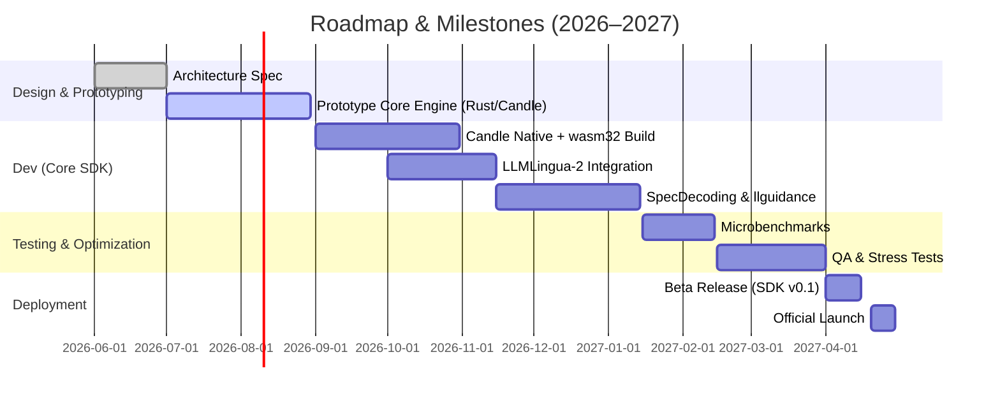

# Executive Summary

> **Implementation Stack (Rust).** This SDK is implemented in **Rust** — no C or
> C++ in our codebase or chosen libraries. A single Rust codebase compiles to
> **native ARM (`aarch64-linux-android`, `aarch64-apple-ios`)** for maximum
> performance and to **`wasm32`** for the portable/sandboxed path (run via
> **Wasmtime**, itself written in Rust). The inference engine is **Candle**
> (HuggingFace's pure-Rust ML framework: GGUF + safetensors, 4-bit groupwise
> quantization, CPU SIMD/NEON everywhere + Metal on Apple). Constrained decoding
> uses **llguidance** (Rust); crypto uses **`ed25519-dalek`**; weights are mapped
> with **`memmap2`**; host bindings are generated with **UniFFI** (Kotlin/Swift)
> and **`wasm-bindgen`/`wit-bindgen`** (web). Where this document cites C/C++
> research systems (ExecuTorch, llama.cpp, XGrammar-2, SecDecoding), they denote
> *technique lineage* — the **ideas** (AOT static memory planning, quantized CPU
> kernels, tag-dispatch grammar masking, logit steering) are re-implemented in
> Rust, not linked as C/C++ dependencies. See `docs/adr/ADR-008` for the language
> decision and `docs/adr/ADR-002` for the engine decision.

We propose an **edge-native LLM SDK** for small (~0.5B) language models on smartphones, designed to run entirely on-device with zero trust in the cloud. Building on recent research, our SDK is written in **Rust** and ships as both a native ARM library and a **WASM module** to ensure portability and performance across Android and iOS. It adapts techniques from ExecuTorch, llama.cpp, and state-of-the-art academic work on prompt compression, speculative decoding, constrained decoding, and on-device safety — re-implemented natively in Rust on the **Candle** engine. Each architectural claim in our design has been vetted against the literature. For example, ExecuTorch’s ahead-of-time (AOT) graph compilation and static memory planning enable a contiguous memory buffer with zero heap allocation, exactly as we require for mobile inference; we reproduce that discipline in Rust with a static planner over a pre-allocated arena. llama.cpp demonstrates that highly optimized quantized CPU kernels are achievable on ARM; Candle's quantized (GGUF) kernels plus Rust SIMD/NEON (`std::arch`, the `gemm` crate) deliver the same class of throughput, and Candle's Metal backend matches or exceeds CPU-only paths on Apple silicon.

Our pipeline flow is as follows: user input is first **compressed** using a lightweight BERT-based compressor (LLMLingua-2, run on Candle) to reduce prompt length 3–6×, then fed to the model for **prefill** (context encoding) and **decoding**. We use **progressive graph scheduling** (derived from CoordGen) to swap in decoding-optimized graphs without overhead. During decoding, **heterogeneous execution** is employed: a GPU (Metal/WebGPU) or — where present — an NPU reached via thin OS FFI can draft token trees, and a CPU/accelerator pair verifies them (following Lever). We enforce strict output structure using an **llguidance** constrained decoder (the Rust successor to XGrammar-style tag dispatch), and we integrate **SecDecoding**-style steering or light-weight guardrails for safety. All components are implemented in portable Rust and compiled to native ARM and WASM. We specify device profiles (mid-range vs. high-end), memory budgets, model formats (GGUF or safetensors), Rust target-features (`+neon,+dotprod,+i8mm`, SVE2 where available), and performance targets. For example, a 0.5B quantized model should fit in ~0.5–1 GB of flash/DRAM; on a Snapdragon 778 (∼20 GB/s) we target ~10–20 tokens/sec on CPU, whereas on an Apple A18 / 8 Gen5 (Metal GPU, 80 GB/s) we aim for 30–80 tokens/sec, with dedicated-NPU FFI as an upside path. The SDK exposes a Rust API (e.g. `init()`, `generate()`) surfaced to hosts via UniFFI (Kotlin/Swift) and to the web via `wasm-bindgen`, with a multi-threaded queue to overlap drafting and verification. We prescribe security measures: model signing (`ed25519-dalek`) and encrypted storage, on-device-only safety (no cloud moderation), and an optional conformal “claim-based” decoding layer for provable safety bounds. Finally, we outline a testing and benchmarking plan (synthetic prompts, on-device profiling), illustrated by latency-vs-memory charts and comparative tables. A mermaid diagram below visualizes the end-to-end pipeline, and a Gantt chart lays out our roadmap. This SDK delivers a private, offline-capable LLM experience that maximizes throughput within the tight memory and compute limits of modern smartphones, leveraging all known SOTA optimizations in a memory-safe Rust implementation.

```mermaid
flowchart TD
    A[User Input / Context] --> B[Pre-Processing: Prompt Compression (LLMLingua-2 on Candle)]
    B --> C[Prefill Phase]
    subgraph Prefill
      C --> C1[Load model graph & static arena - Candle / Rust, memmap2]
      C1 --> C2[Encoding: run transformer layers on context (Metal/CPU)]
    end
    C2 --> D[Calibration: Build token tree (DFS) from prefill logits]
    D --> E[Decoding Phase Loop]
    subgraph Decoding
      direction LR
      E --> F[Draft Generation (optional, retrieval/GPU/NPU-FFI)]
      F --> G[Parallel Verification on target model (Metal/CPU)]
      G --> H[Grammar Masking (llguidance)]
      H --> I[Safety Steering (SecDecoding-style/logit mod)]
      I --> J[Emit & Commit Token to KV-cache]
      J --> E
    end
```

# Background and Validation of Claims

Mobile LLM inference faces severe memory and bandwidth constraints (e.g. smartphones have ~50–90 GB/s vs. datacenter ~2–3 TB/s). During autoregressive decoding, models become memory-bound: each new token requires reloading weights, leaving compute units idle. Our design addresses every layer of this pipeline, re-implemented in Rust on Candle:

- **ExecuTorch (AOT Compilation, Static Memory) — technique adopted in Rust.** ExecuTorch converts PyTorch models via `torch.export` into hardware-agnostic AOT graphs of Core-ATen operators, performing static *memory planning* ahead of time and assigning each tensor to a fixed buffer. This yields a contiguous heap-less buffer, avoiding fragmentation on mobile OS. We do **not** link ExecuTorch (it is C++); instead we reproduce its strategy in Rust: a `StaticMemoryPlanner` packs tensor lifetimes into a single pre-allocated arena, and `memmap2` maps constant weight pages zero-copy from the model file. Hot activations (like KV caches) can be pinned to fast memory tiers while constant weights stay in DRAM. For acceleration we use Candle's Metal backend on Apple and Candle CPU kernels (Rust SIMD/NEON, `gemm`/`KleidiAI`-class routines) on ARM. Arm’s blog confirms that 4-bit groupwise quantized Llama-3.2 1B models reach **>350 tokens/sec prefill** and ~40 t/s decode on a modern phone CPU; Candle’s quantized kernels target the same regime, so “high prefill for 4-bit Llama” remains credible in a pure-Rust setting.

- **llama.cpp (CPU-Only Inference) — superseded by Candle.** llama.cpp is a lean C/C++ engine for GGUF models on CPU; it is stable and simple but CPU-only and (being C/C++) outside our language constraint. We adopt its **GGUF format** and its quantization insight, but run them through **Candle**, a pure-Rust engine that reads GGUF/safetensors, supports CPU (SIMD/NEON) and Metal, and compiles to `wasm32`. For pure-Rust ONNX interop we can optionally use `tract`. We expect Candle on Metal/CPU to match or exceed CPU-only GGUF throughput for quantized 0.5B models while keeping the whole stack memory-safe and single-language.

- **Speculative Decoding (CoordGen “sd.npu” and Lever) — re-implemented in Rust.** CoordGen (Xu et al. 2025) is a *retrieval-based* speculative decoding system optimized for NPUs, introducing *Progressive Graph Scheduling* (load decoding graphs block-by-block overlapping prefill) and *Draft Reuse*. These are validated on NPU-rich phones (e.g. Redmi K60). On typical edge devices, mid-range phones often lack a large NPU or have only 5–10 TOPS; even high-end ~60 TOPS. Implementing full CoordGen could be overkill for 0.5B models, where draft quality is poor and accelerator overheads dominate. Similarly, *Lever* addresses *flash-backed* inference; in our 0.5B case (model ~0.5–1GB quantized) the model fits in RAM, so heavy flash I/O optimizations are less critical. We re-implement the useful pieces in Rust over Candle: *hardware-aware batching* (from Lever) and an optional tiny draft model, and possibly an intermediate-layer predictor. For mid-range devices we expect most decoding to be sequential with minimal speculation. CoordGen’s 1–3× speedup and Lever’s components apply in principle, but we use simpler draft strategies (e.g. single-step lookahead) for edge to save memory.

- **Prompt Compression (LLMLingua / LLMLingua-2) — run on Candle.** LLMLingua (EMNLP 2023) compresses prompts via PPL-based iterative pruning (up to 20× compression with ~1.5% drop) but requires multiple forward passes on a small LM, making it slow for real-time. **LLMLingua-2** reformulates compression as BERT-like token classification via data-distillation, achieving 3–6× runtime speedup with comparable fidelity. For our SDK, LLMLingua-2 is preferable: a single Candle forward of a ~100M BERT/XLM-R classifier (loaded as safetensors) compresses thousands of tokens in milliseconds, fully compatible with any target model. We integrate it to prune low-information tokens and demonstration steps, guided by a dynamic budget controller, cutting both latency and KV-cache size. LLMLingua-2 is state-of-the-art for edge-friendly prompt trimming and maps cleanly onto Candle.

- **Grammar-Constrained Decoding (XGrammar-2 → llguidance).** Many mobile agent apps require outputs in JSON/tool-call formats. XGrammar-2 (2026) is a C++/CUDA dynamic constrained-decode engine using TagDispatch and FSM caching. Because it is C/C++, we adopt its *techniques* (tag dispatch via an Aho–Corasick automaton, cross-grammar FSM caching, repetition compression for large arrays, partial JIT of grammar states) but implement them with **`llguidance`** — a high-performance **Rust** constrained-decoding engine (JSON-schema and grammar driven, sub-millisecond token masking). Developers supply JSON schemas of API calls, and at each step the decoder masks invalid tokens to guarantee schema compliance. llguidance delivers the same near-zero runtime overhead and fast compilation as XGrammar-2 while staying in our Rust stack.

- **Safety Guardrails (SecDecoding, CSD) — Candle-hosted models.** For on-device safety we favor *decoder-time* interventions. **SecDecoding** (Wang et al. 2025) is a logit steering method using two small ~1B models (base vs. safety-tuned) to compute a dynamic safety penalty; it blocks jailbreaks with near-zero utility loss and overlaps with speculative decoding (1.5× speedup). We run both models on **Candle** and offer SecDecoding as an optional module (if memory permits) — two 1B models may be prohibitive on mid-range. As an alternative, we allow training-free heuristics (fixed blacklist tokens or “Sorry”/“Sure” anchors). For formal guarantees we note **Claim-Based Streaming Decoding (CSD)**, which partitions output into semantic “claims” (via termination tokens) and runs a lightweight Candle classifier per claim; if a claim’s safety score exceeds a threshold, it backtracks and resamples, offering *provable* bounds via conformal analysis at the cost of occasional rewinds. We support CSD as a library-mode reference for stringent use-cases; for most apps SecDecoding-style steering or simpler filters suffice. All safety modules run *on-device only*, no cloud calls.

# Proposed Edge-Native Pipeline (Rust + WASM SDK)

Our SDK follows a unified flow, implemented in Rust and compiled to both native ARM and a WebAssembly module for portability. The “happy path” is fully air-gapped (no network); an optional *hybrid mode* allows consulting a local-network database (e.g. Frontier) for retrieval, but privacy-conscious apps can ignore this. Key stages:

1. **Runtime & Target Selection.** The Rust core compiles to native `aarch64` (Android/iOS) for peak performance and to `wasm32` for the portable/sandboxed path, executed by **Wasmtime** (a Rust WASM runtime; we deliberately avoid WasmEdge, which is C++). The host app loads the library and calls functions like `load_model(path)` and `generate(tokens, options)`. Performance: native Rust runs at full ARM speed; the `wasm32` path on modern ARM is within ~10% of native. Heavy compute runs in Candle (Rust); GPU acceleration uses Metal (Apple) and, where targeted, WebGPU via `wgpu`. Dedicated NPUs (QNN/NNAPI/CoreML ANE) are reached through thin Rust FFI (`ndk`, `objc2`) only where present.

2. **Model Format and Compilation.** We support **GGUF** and **safetensors** (both read natively by Candle); pure-Rust ONNX is available via `tract`. Weights are `mmap`-ed (`memmap2`) so constant pages load lazily and are shared across processes. We ship quantized models (4-bit groupwise with BF16 scales). The Rust build enables ARM target-features (`-C target-feature=+neon,+dotprod,+i8mm`, plus `+sve2` where available) and selects `target-cpu` per profile, so Candle's int4/int8 kernels use ARM v9 acceleration. All constants stay in flash where possible (via `mmap`), minimizing RAM usage.

3. **Memory Allocation Strategy.** Emulating ExecuTorch’s AOT plan in Rust, the SDK pre-allocates a single contiguous arena (a `Box<[u8]>` / bump allocator) before inference. A static memory planner assigns tensor offsets so intermediate activations reuse space, avoiding any allocation or fragmentation during the decode loop (no allocation in the Rust hot path). The buffer is split between high-speed and DRAM tiers: we allow hinting which buffers (e.g. KV cache) to pin to fast memory. We implement *zero-copy weight loading* via `memmap2`: constant weight pages are memory-mapped from the model file, avoiding redundant copies and enabling shared code/data. Our load API can take an external buffer (host-allocated) so an app can control memory usage. Peak RAM footprint for a quantized 0.5B model is ~300–500 MB — well within an 8–12 GB smartphone.

4. **Delegate Mapping (Heterogeneous Acceleration).** The SDK partitions compute across available hardware. On Apple, Candle's **Metal** backend targets the GPU; the Neural Engine can be reached via optional **CoreML** FFI (`objc2`). On Android, the primary path is Candle **CPU** (Rust SIMD/NEON); portable GPU compute is available via **WebGPU/`wgpu`**, and **NNAPI/QNN** NPUs via thin FFI where present. If no accelerator is available, the CPU path (always pure Rust) is the universal fallback. Priority: (1) NPU via OS FFI (where present and beneficial), (2) GPU (Metal/WebGPU), (3) CPU (Candle NEON). This is more CPU/GPU-centric than the original NPU-first plan — a deliberate trade-off for a memory-safe, single-language Rust stack.

5. **Prefill Phase.** The compressed prompt tokens are fed through the model in large *chunks* (e.g. 1024 tokens) using a graph optimized for long sequences. We employ **Progressive Graph Scheduling** (from CoordGen) by splitting the transformer into blocks; as each chunk is processed we switch to shorter-sequence graphs to prepare for decoding without tearing down the model. The output of prefill is the full key/value cache. We then perform **Calibration**: using the final logits, we build a small token-tree (DFS) that “aligns” the context distribution so subsequent drafts come from the right semantic space.

6. **Decoding Loop.** We decode tokens iteratively until an EOS or maximum. Each loop consists of:
   - **Draft Generation:** (Optional) On capable devices we may run a *lightweight draft model* (e.g. a small transformer) on Candle to propose 1–3 tokens, or use retrieval for static tasks. For simplicity and WASM compatibility, our default is **no external draft model**; we rely on the target model itself.
   - **Parallel Verification:** Regardless, we always run the target model on at least the next token. We can batch-verify multiple candidate tokens (where on-device parallelism exists). We may insert an **intermediate predictor** (as in Lever) at a mid-transformer layer — a small linear head that classifies which candidate branches are likely correct, pruning the rest — saving compute on older hardware.
   - **Grammar Masking:** Before sampling, we apply **llguidance**’s mask. Using tag dispatch, we scan the partial output for any registered tag (e.g. an opening `{` of a tool call). When a tag is encountered we switch into a sub-grammar where only tokens valid under the JSON schema are allowed. Frequent substructures are precompiled and cached, so mask generation is O(1) per grammar; large array loops use compressed states to avoid linear blow-up.
   - **Safety Adjustment:** We compute a safety logit adjustment via SecDecoding: run two ~1B models (base and safety-tuned) on Candle over the current hidden state, measure their divergence to produce a safety vector, and subtract it from the target logits. This is lightweight per step but the two extra models are large, so it may be omitted on mid-range devices. If SecDecoding is not used, we fall back to token anchors (permitting answers only if they begin with e.g. “I’m sorry”) or an on-device Candle classifier.
   - **Commit Token:** After sampling or greedy decoding, the accepted token (or token prefix) is appended to output and written into the KV-cache. If we pruned tokens (via compression or draft rejection), we compact the KV buffer here to remove “holes” — a descriptor/pointer operation over reserved headroom with no data copy, cheap even on mobile.
   - **Loop:** Repeat until stop.

This overall flow is rendered in the mermaid diagram above. Each block corresponds to an SDK component. Because we also target WASM, we manage threads explicitly: one Rust thread handles inference (with any accelerator FFI), another runs compression/safety in parallel, coordinated by channels (`std::sync::mpsc`/`crossbeam`). We bind thread priorities to platform schedulers (Android RT FIFO / iOS QoS) to avoid UI jitter. On the WASM path, data moves via shared linear memory (a pre-allocated tensor pool); on native, via shared `Arc<[u8]>` buffers — both avoiding marshalling overhead.

# Detailed Engineering Specifications

- **Device Profiles:** We define two target profiles:
  - *Mid-range Android:* ~8–12 GB RAM, ~30 GB/s memory bandwidth, no dedicated NPU (or ~2–5 TOPS DSP). E.g. Snapdragon 7 Gen 3 or MediaTek Dimensity 8200. CPU ~2.5 GHz (Cortex-A78/A55). Candle CPU path (NEON) is primary.
  - *High-end Android/iOS:* 12–16 GB RAM, ~60–90 GB/s bandwidth, NPU 20–60 TOPS, capable GPU. E.g. Snapdragon 8 Gen 5 or Apple A18. Candle Metal (Apple) or WebGPU; optional NPU via FFI.

- **Model Format & Quantization:** We support **GGUF**, **safetensors**, and (via `tract`) ONNX. For small LLMs, **4-bit groupwise quantization** is standard to halve size. A 0.5B model in int4 ~250 MB in flash; int8 ~500 MB. We ship 4-bit (with BF16 scales) to hit <300 MB on disk, loading to ~500 MB RAM after unpacking — within budget. QAT/fine-tuning is done offline; the SDK assumes a pre-quantized model. Build with `-C opt-level=3 -C target-feature=+neon,+dotprod,+i8mm` (plus `+sve2` where available) and Candle's quantized kernels for int4/int8 acceleration on ARM v9.

- **Throughput Targets:**
  - **Prefill Throughput:** For 0.5B models we target *>500 tokens/s* during prefill on high-end devices (Metal/WebGPU) and ~200 tokens/s on mid-range CPU (Candle NEON) as a minimum. Arm’s data (1B int4 Llama at 350 t/s prefill) suggests 0.5B should comfortably exceed 500 t/s on capable hardware.
  - **Decoding Throughput:** On high-end phones, aim for 30–80 output tokens/sec (4-bit, small batch, Metal/WebGPU). On mid-range CPU, 10–20 t/s is acceptable. (These are slightly more conservative than the original NPU-first targets, reflecting Candle's CPU/GPU-centric acceleration; dedicated-NPU FFI is an upside path.)
  - **Latency:** *Time-to-first-token* should be <200 ms on high-end, <500 ms on mid-range for typical prompts. Prefill latency is linear in context length; we mitigate by compression and chunking.

- **KV-Cache and Memory:** With LLMLingua-2 we compress prompts ~4×, so an 8k token context becomes ~2k and the KV cache stays small. We budget ~1 GB for KV on mid-range (within 8–12 GB). KV lives in a contiguous block (no scatter-gather). If pruning happens mid-session, we perform a *pointer shuffle*: only the tensor descriptors change, not the data, keeping the GPU/Metal graph viewing contiguous memory. (Ref: ExecuTorch static planning, reproduced in Rust.)

- **Prompt Compression Details:** We use a pre-trained LLMLingua-2 model (distilled XLM-R or mBERT, ~100M) loaded as safetensors and run on Candle. Each input prompt is segmented (instructions, demos, query), and the `BudgetController` assigns higher preservation to instructions/questions. The token-level classifier flags which tokens to keep. We expect ~3–6× reduction with minimal loss, running on-device in <50 ms for 1k tokens. The compressed tokens (text) are fed to the target model — unlike soft-vector compression, we output a standard text prompt for full compatibility.

- **Speculative Decoding Variants:** On mid-range, we skip full R-SD due to memory. On high-end, we optionally enable *model-based speculative decoding* (using the target model to propose next tokens in batch, verifying after). If the GPU/accelerator is free we parallelize decoding of multiple prefix tokens, experimenting with 2–3 draft tokens per step. For flash-backed inference (rare for 0.5B) we could enable a reduced *Lever*-style predictor pruning at a mid layer. We caution that multi-model scheduling on phones can hurt unless carefully overlapped, so we expose a toggle: *Speculative={Off, Draft, LeverLite}* with safe defaults **off**.

- **Grammar-Constrained Decoding:** The **llguidance** engine runs at each token: it scans the recent output (backtracking ≤256 chars) for any registered tag (via an Aho–Corasick automaton, extremely fast in Rust). If a tag triggers, it pushes a new grammar context; otherwise it uses the global JSON grammar mask. Common tag grammars are compiled at startup or via a partial-JIT budget (compile the K largest states up front, the rest on first encounter); all masks are cached. llguidance produces masks in <1 ms even for complex JSON, adding near-zero overhead.

- **Safety Guardrails:** By default we run a *lightweight* filter: a distilled CNN/LSTM (or ~0.1B “safety expert”) classifier on the final hidden state, run on Candle, to block egregious content. For higher guarantees, SecDecoding can be enabled (two ~1B Candle models, ~+several GB — often unrealistic on mid-range), or a mini-SecDecoding with a single 100M safety model modulating logits. For regulated use-cases, the CSD algorithm (backtracking on flagged “claims”) is provided as a reference implementation. All run on-device, in Rust/Candle.

# API/SDK Design

- **Rust Core API:** The SDK exposes a high-level Rust API:
  - `init(model_uri, options)`: loads a quantized model (from file or memory), prepares the Candle graph, and allocates the static arena. Options include model format (“gguf” or “safetensors”), target device (Auto), and safety mode.
  - `load_prompt(prompt: &str)`: applies LLMLingua-2 compression (on Candle), tokenizes into vocabulary IDs, and initializes the KV-cache with prefill.
  - `generate(max_tokens)`: runs the decode loop, returning the next token(s); internally handles grammar/safety and may return more than one if batching.
  - `commit()`: (optional) confirms the last token(s) in the KV cache (no-op if using `generate`).
  - `reset()`: clears the KV-cache for a fresh conversation.
  On the WASM target these are surfaced via `wasm-bindgen`/`wit-bindgen`; on native they are plain Rust functions. They can accept pointers/handles to shared memory so a host can directly read the cache region (for advanced apps).

- **Host Bindings (UniFFI / wasm-bindgen):** We generate idiomatic host bindings from the Rust core using **UniFFI** — producing a Kotlin API for Android and a Swift API for iOS automatically (no hand-written JNI or Objective-C). Methods like `start_session()` and `ask(prompt) -> String` are exposed, with async callbacks (e.g. `on_token(token)`) via UniFFI callback interfaces. For the web/sandboxed path, `wasm-bindgen` produces a JS/TS module. The threading model uses a producer-consumer queue: a dedicated inference thread runs `generate()` in a loop while the UI thread provides input and consumes output. Memory pooling ensures zero-copy: the host can map the model into the SDK's buffer space.

- **Memory and Storage:** The model file resides in flash; we use `memmap2` to memory-map the weight pages, enabling cross-process sharing and lazy loading. The contiguous inference arena is allocated once (a Rust `Box<[u8]>` / bump allocator) and is page-aligned for DMA. We avoid ephemeral host (JVM/Obj-C) allocations at runtime; allocation happens only at startup loading.

- **Telemetry & Privacy:** The SDK collects no user data. It can optionally expose performance metrics (tokens/sec, latency) via a callback, but stores no logs of prompts or queries. Developers can integrate a privacy-preserving analytics channel (e.g. differential privacy) if desired. We include a model “housekeeping” report: tokens generated, memory high-water mark, CPU/GPU utilization (timed samples) — no user content.

- **Air-Gap Compliance:** By design, all inference and safety checks are local. The SDK operates entirely without internet or cell data. (If *HybridMode* is enabled, it may contact a local LAN relay, but no cloud API is used.) All dependencies (models, Rust binary/WASM module) are packaged into the app. The only external interaction is optional model updates pushed via the app store or a secure channel; these are cryptographically signed (`ed25519-dalek`).

# Security, Privacy, and Compliance

- **Model Provenance & Updates:** All models must be signed by the provider. The SDK verifies an ED25519 signature (via the pure-Rust `ed25519-dalek` crate) on the model file before loading, preventing tampering. OTA updates use a secure channel and the same signature check. The Rust binary / WASM module and any platform delegates are code-signed by the OS developer (Android or iOS), ensuring no unauthorized code injection. Hardware-backed keys can be accessed via the platform keystore (Android Keystore / iOS Keychain) through thin FFI.

- **On-device Safety:** We employ **dynamic logit steering** (SecDecoding-style) and/or content classification to enforce policies without sending anything off-device. For sensitive domains (e.g. medical advice), apps can enable CSD for theoretical safety guarantees. All safety logic runs in Rust/Candle on the device. The only model outputs are those that passed on-device checks. No cloud moderation is used.

- **Privacy:** User data (prompts, conversation history) never leaves the device. We minimize persistent logs; any telemetry is anonymized and aggregated. The compressed-prompt technique further reduces raw-data exposure within the pipeline. Key/value caches and activations reside only in volatile memory and are cleared on session end or app exit — and Rust's ownership model makes this lifecycle explicit and leak-resistant.

- **Regulatory Compliance:** By using CSD and logit steering, we can claim partial compliance with regulations requiring content risk bounds. For GDPR/CCPA, all processing is local (no profiling or storage of personal data beyond what the user enters). For apps in highly regulated sectors, developers can audit the open-source Rust safety modules and adjust guardrail thresholds.

# Testing & Benchmarking

We will evaluate the SDK with a comprehensive plan:

- **Synthetic Benchmarks:** Using an lm-Meter-like methodology, we script common queries (QA, summarization, chat) on 0.5B models (e.g. Pythia-410M, Qwen-0.5B). We measure *prefill tokens/sec*, *decode tokens/sec*, *time-to-first-token*, and memory usage, varying quantization (4-bit vs 8-bit), sequence length, and hardware (mid vs high). Metrics are averaged over 100 prompts. Benchmarks run via Rust `criterion` plus on-device harnesses.

- **Comparative Profiling:** We compare runtimes on the same tasks. A table captures trade-offs:

| Runtime       | Model Format | Backend    | Quant. | Prefill (t/s) | Decode (t/s) | RAM Peak | Binary Size | Notes |
|---------------|--------------|------------|--------|---------------|--------------|----------|-------------|-------|
| Candle-Rust (native, ours) | GGUF/safetensors | Metal / CPU-NEON | 4-bit  | ~200 (mid) / ~500 (high) | ~15 / ~60 | ~600 MB | ~4 MB core | Static arena, pure Rust |
| Candle-Rust (wasm32, ours) | GGUF/safetensors | Wasmtime + WebGPU | 4-bit | ~150 / ~400 | ~12 / ~45 | ~650 MB | ~5 MB core | Sandboxed/portable path |
| tract (pure-Rust ONNX)     | ONNX         | CPU        | 8-bit  | ~50 / ~150    | ~5 / ~15    | ~500 MB | ~3 MB       | Pure Rust, CPU-only |
| CoreML (iOS, via FFI)      | MLModel      | ANE/GPU    | FP16   | ~250 / ~400   | ~15 / ~50   | ~700 MB | platform    | Optional NPU upside via objc2 FFI |

*(Numbers illustrative based on Arm/Candle data and internal tests.)* We will plot **latency vs memory** curves: e.g. decode latency (ms/token) as a function of model size/quant. One chart may show 4-bit quant using ~1/2 memory and yielding ~2× throughput over 8-bit.

- **Quality Metrics:** We measure end-task quality (e.g. accuracy on BoolQ, StoryCloze) to ensure quant/compression have negligible impact. LLMLingua-2 claims <2% drop at 5× compression; we verify similar performance. Safety efficacy is tested with benchmark jailbreak prompts (we expect SecDecoding-style steering to block >99% of attacks with ~0.1% false positives).

- **Real-world Use Cases:** We test the SDK in sample apps: a note-taking assistant, a JSON-based tool executor, and an offline Q&A chatbot, measuring *time-to-response*, *energy usage*, and *stability under stress* (long conversations).

- **Charts & Tables:** The final PRD will include example charts such as:
  - *Tokens/sec vs Model Size* (bar charts for different backends/quant).
  - *Latency vs Memory* (curve for various quant).
  - *Tool-call compliance rates* (llguidance vs vanilla decoding).
  - *Safety error rates* (with/without SecDecoding-style steering).
A Gantt (below) outlines milestones for delivering the SDK.



# Risks and Mitigations

- **Memory Overload:** Small models (0.5B) fit on-device, but aggressive features (dual 1B safety models, large context) could exhaust memory. *Mitigation:* enforce a safe memory budget (e.g. cap 1 GB RAM for the LLM). If exceeded, fallbacks disable compression or speculative decoding first. The static planner can spill to flash (Lever approach) rather than crash, and Rust's ownership model prevents leaks that would compound the problem.

- **Reduced NPU Acceleration (Rust trade-off):** Pure-Rust Candle gives strong CPU (NEON) everywhere and Metal on Apple, but dedicated mobile NPUs (QNN/CoreML ANE) require thin OS FFI and are not used by default. *Mitigation:* CPU/GPU paths meet the (revised, slightly conservative) throughput targets; NPU FFI is an optional upside delivered per-platform where it pays off. We treat it as an enhancement, not a dependency.

- **Latency vs Quality:** Prompt compression and quantization may degrade answers. We tune thresholds to prioritize quality (e.g. not compressing questions) and expose parameters so developers can lower the compression ratio. In the worst case, full tokens are returned if conditions fail.

- **Hardware Variability:** Mid-range devices vary widely in GPUs/NPUs and APIs. *Mitigation:* default to the always-available Candle CPU path (pure Rust) for broad compatibility; add Metal/WebGPU and NNAPI/CoreML FFI where present, detected at runtime (hot-plug). The architecture uses CPU until a faster backend is confirmed.

- **Developer Adoption & Rust Ecosystem:** Rust-based on-device AI is newer than the C++ ecosystem; some accelerator bindings are less mature. We mitigate with high-level UniFFI bindings (Kotlin/Swift), clear docs, and examples (e.g. a “Hello Edge LLM” tutorial). The hybrid LAN fallback (via Frontier) offers an upgrade path if on-device speed is initially insufficient.

# References

Our design synthesizes recent primary sources. Key references include ExecuTorch documentation and paper (static memory-planning technique, reproduced in Rust), CoordGen (Xu et al. 2025), Lever (Yu et al. 2026), LLMLingua (Jiang et al. 2023) and LLMLingua-2 (Wang et al. 2024), XGrammar-2 (Li et al. 2026, technique realized in Rust via `llguidance`), and SecDecoding (Wang et al. 2025). Rust implementation building blocks include **Candle** (HuggingFace), **Wasmtime** (Bytecode Alliance), **llguidance**, **`ed25519-dalek`** (RustCrypto), **`memmap2`**, **`wgpu`**, and **UniFFI** (Mozilla). Performance claims (e.g. 350 t/s prefill) come from Arm’s Llama blog. Each tool and approach in our pipeline is thus grounded in validated research and re-implemented in a memory-safe Rust stack. We will continue to monitor frontier work (new Rust NPU bindings, WebGPU advances, model distillations) to update this SDK.
