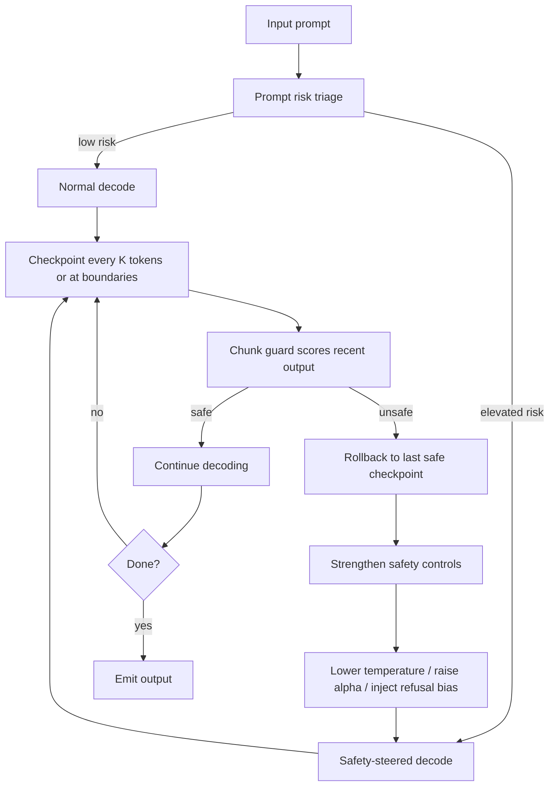
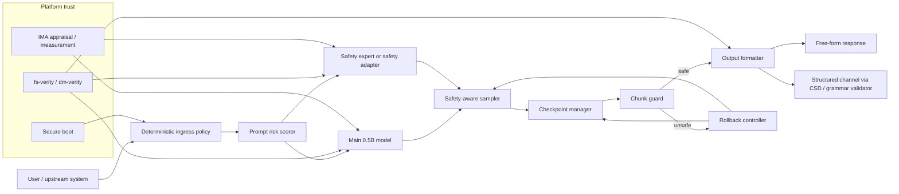

# Implementing SecDecoding and CSD Style Model Backed Safety With Runtime Backtracking on Offline Air Gapped Edge Devices

## Executive summary

This report assumes no fixed hardware platform, operating system, latency target, or power budget beyond the stated requirement that the system be fully offline and air-gapped. I also interpret **CSD** in the sense used by **Synchromesh**—**Constrained Semantic Decoding**—because that is the CSD variant most directly tied to runtime validators, semantic constraints, and rollback/backtracking mechanics. Under those assumptions, the strongest practical architecture for a **~0.5B open-weight edge deployment** is usually **not** a pure implementation of SecDecoding or a pure implementation of CSD. It is a **hybrid**: a quantized small instruct model for primary generation, a small safety sidecar or safety adapter for decoding-time steering, a **checkpointed token/KV-cache rollback loop**, and a **deterministic policy boundary** for any high-impact outputs or actions. This combines the low operational footprint of decoding-time steering with the stronger recoverability of rollback and the stronger assurance of symbolic constraints where the output space is structured.

The central distinction is this. **SecDecoding** uses a pair of small contrastive models—a base model and a safety fine-tuned expert—to estimate a token-level safety signal from their output-distribution divergence, then adds that signal to the target model’s logits; in the published EMNLP 2025 form it is modular, resource-efficient, and compatible with speculative decoding, but it still assumes continuous access to auxiliary models during decoding. **SafeDecoding**, by contrast, intersects top-token sets from an original model and a safety-tuned expert model, then linearly reweights token probabilities; it is cheaper to implement on edge devices, especially if only applied for the first few tokens. **CSD** is different again: it is not mainly “safe steering,” but **constraint-preserving decoding** against a completion engine that defines the valid continuation set; if the completion engine is exhaustive and correct, the output satisfies those constraints by construction.

For **0.5B-class edge models**, the most attractive deployment pattern is usually: **Qwen2.5-0.5B-Instruct or Qwen3-0.6B** as the main model; **4-bit or mixed-INT4** for GPU/NPU paths, **INT8** where tooling is simpler; **memory-mapped** model loading when available; **chunk-level** guard evaluation every few tokens instead of every token; **KV-cache checkpoints** every few tokens and at semantic boundaries; and **rollback to the last safe checkpoint** when a guard score crosses threshold. If the device must emit structured outputs—commands, JSON, configuration, SQL, or code snippets used for actuation—then add a **CSD-style grammar/semantic layer** around the final emitted channel.

The assurance story should be explicit about what is and is not provable. You can obtain strong guarantees for **boot integrity** and **artifact integrity** with **secure boot**, **dm-verity/fs-verity**, **IMA appraisal/measurement**, and optional **TPM-based attestation**. You can obtain strong guarantees for **structured-output validity** with CSD-style completion engines. You **cannot** obtain a blanket semantic-safety guarantee for unconstrained free-form text from decoding-time steering alone, and current LLM judges are themselves brittle under prompt sensitivity and adversarial attack. For air-gapped deployments, this means the system should treat model-backed safety as **one layer** in a broader secure systems design, not as the entire safety case.

## Definitions and the approach landscape

### What SecDecoding is

**SecDecoding** is a **decoding-time defense** that uses two small contrastive models—a small base model and a safety-tuned expert—to estimate a **token-level safety signal** from the difference in their logits. That signal is scaled by a dynamic factor that depends on divergence and token position, then added to the target model’s logits before sampling. In the paper’s formulation, the approach is modular, requires only the auxiliary contrastive models rather than re-training the target model, and is compatible with speculative decoding; the paper reports near-zero attack success rates across advanced jailbreak attacks while preserving helpfulness, and states that only an auxiliary **1B-parameter** model is required in the demonstrated setup.

The important implementation consequence is that SecDecoding is **sidecar-style safety steering**. It is attractive when you want to leave the main model untouched and drive its logits with a safety signal produced by smaller models. On resource-limited edge devices, though, the need to run auxiliary models during generation means SecDecoding is easiest to justify on **GPU/NPU-equipped devices** or when you can **gate the auxiliary path** to only the riskiest phases of decoding. That last point is an engineering inference from the paper’s architecture and from edge memory/latency constraints, rather than a claim made verbatim by the authors.

### What SafeDecoding is and how it differs

**SafeDecoding** is also a decoding-time defense, but its mechanism is simpler and more directly edge-friendly. It fine-tunes an **expert model** from the original model, constructs a **sample space** as the intersection of top tokens from the original and expert models, and then defines a new probability distribution by interpolating the original probabilities with the expert-vs-original difference. The paper explicitly recommends applying the strategy only to the **first few decoding steps**, motivated by the observation that jailbreaks often succeed by forcing the model into an affirmative initial trajectory; this is one reason SafeDecoding is attractive on constrained hardware.

Relative to SecDecoding, SafeDecoding is usually the better starting point for a **0.5B offline edge system** if you want the main benefit of model-backed token steering without the full overhead of continuously running separate contrastive small models at every step. It is less expressive than SecDecoding’s dynamic divergence-based safety signal, but it has a cleaner **same-family deployment story**: one main model, one PEFT-tuned safety expert, selective use on early tokens, and straightforward fallback to standard decoding outside high-risk windows.

### What CSD is and how it differs

In **Synchromesh**, **Constrained Semantic Decoding** is a general framework for constraining generation to a set of valid programs by querying a **completion engine** over partial outputs. The completion engine can embody both **context-free** constraints, such as syntax, and **context-sensitive** constraints, such as schema validity or type/scoping rules. The paper’s main claim is strong: when the completion engine is exhaustive and correctly implemented, CSD guarantees that all sampled outputs satisfy the implemented constraints **by construction**. The authors also report an average **8% sampling overhead** in their GPT-3 experiments.

That makes CSD conceptually different from both SafeDecoding and SecDecoding. CSD is not primarily a “safety signal” method; it is a **valid-continuation filtering** method. It is therefore strongest when “safety” can be re-expressed as membership in a formally checkable language or prefix-closed valid set: safe JSON schemas, command allow-lists, typed tool signatures, safe SQL fragments, or restricted code subsets. It is weaker for nuanced free-form harms that do not reduce cleanly to syntax or semantics.

### Related model-backed safety families

The last five years of literature show several adjacent families that matter for edge implementation design:

| Technique | Core mechanism | Strength | Main weakness | Edge relevance |
|---|---|---|---|---|
| **DExperts** | Product-of-experts combining a base LM with expert and/or anti-expert LMs at decoding time | Clean general formulation for attribute control | Extra model calls and tuning burden | Good conceptual basis for safety sidecars |
| **SafeDecoding** | Intersection of top-token sets from original and safety expert, with reweighted probabilities | Simple, effective, early-token application helps edge fit | Limited expressivity; no hard guarantees | Very good default for 0.5B edge |
| **InferAligner** | Cross-model guidance using safety steering vectors to modify activations | Decouples harmlessness from helpfulness; no full re-training of target | Requires activation intervention support | Strong where runtime hooks are available |
| **SafeInfer** | Safety amplification vector in hidden states plus safety-guided decoding using harmful-model debiasing | Combines latent steering with decoding control | More moving parts than SafeDecoding | Good for NPU/GPU phones; harder on tiny CPUs |
| **SecDecoding** | Small base + safety expert produce divergence-based safety signal added to target logits | Modular, scalable, speculative-decoding compatible | Continuous auxiliary model use | Better on stronger edge hardware |
| **DeAL** | Decoding framed as search with custom reward/alignment objectives | Flexible, customizable objectives | Slower search-heavy inference | Usually too costly for 0.5B edge unless heavily simplified |
| **CoSA** | Inference-time adaptation to natural-language safety configurations | Useful for pluralistic or changing safety requirements | Needs training for controllability | Useful when policy configs must vary offline |
| **InferenceGuard** | Constrained MDP in latent space with augmented safety state | Formal “almost sure” guarantee relative to the defined safety cost model | Guarantee is cost-model-dependent; implementation is not yet mature as edge software | Important for assurance design, not yet the easiest production choice |
| **CSD** | Completion-engine-constrained valid-token decoding | Hard validity guarantees for structured outputs | Nontrivial constraint authoring; limited free-form semantic coverage | Best assurance for structured channels |

The most important analytical takeaway is that **“model-backed safety” is not one thing**. Some methods steer **logits**; some steer **activations**; some change **search**; some attach **formal completion engines**; some add **rollback**; and some aim for **formal cost-model guarantees**. On edge devices, this matters because different families stress different resources: logits steering stresses repeated forward passes, activation methods stress runtime hooks, completion engines stress validator complexity, and rollback stresses snapshotting and loop control.

## Runtime backtracking mechanisms

Runtime backtracking is the missing piece that turns safety steering into a **recoverable control loop** instead of a one-shot gate. The recent safety and code-generation literature converges on the same systems lesson: once an autoregressive model has started generating along a bad trajectory, post-hoc repair is expensive and often too late; better systems detect problems during generation and **rollback to an earlier safe prefix**. That is explicit in the 2025 ICLR backtracking paper using a special **[RESET]** token, in **RoCode**’s incremental error detection with rollback and constrained regeneration, and in **Hydra**’s checkpoint-and-rollback support with asynchronous checking.



### Backtracking algorithms that are actually useful on edge

There are four algorithms worth separating:

**Token-buffer rollback** keeps only the last *B* emitted tokens and replays from the most recent safe prefix. This is the lightest implementation, but if you do not also checkpoint the **KV cache**, replay cost will dominate latency on weaker hardware. That makes token-buffer-only rollback acceptable mainly for very short outputs or CPU-only prototypes. The practical runtimes that matter for LLM deployment already revolve around explicit **generation loops** and **KV-cache management**, which is why real implementations should treat KV state as the rollback object, not just token text.

**Checkpointed rollback** snapshots generation state every *K* tokens and at semantic boundaries such as newline, sentence break, closing brace, or tool-call delimiter. The state to snapshot is normally: emitted token IDs, sampler RNG state, safety-control state, and **KV-cache metadata or handles**. With block-based caches, such as TensorRT-LLM’s KV block pool, storing cache **block references** is much cheaper than copying tensors; with ONNX Runtime GenAI, the generation loop and KV management are explicit enough to support the same pattern.

**Model-self-backtracking** trains the model to emit a reset action. In the ICLR 2025 backtracking work, the model produces a **[RESET]** token when it recognizes that a partial generation is unsafe; the serving stack then discards the preceding unsafe text and allows a fresh safe continuation. This is elegant because rollback becomes model-native, and the paper reports a large safety improvement without helpfulness regression in their evaluations, but the method still requires **specialized tuning** and does not remove the need for an external guard if you care about adversarial robustness on an air-gapped device.

**Asynchronous validator rollback** is the most systems-efficient idea in the recent literature. **Hydra** shows that checking can proceed **asynchronously** with generation, so the checker adds almost no cost when the output remains valid; when a violation does appear, the system rolls back to a more appropriate earlier checkpoint instead of repairing only the immediate token. For constrained outputs this is often superior to pure per-token CSD, and the same principle transfers well to safety checks on edge devices: score every 4–16 tokens, not every token, unless the prompt is already high-risk.

### Reversible computation versus checkpointing

There is a long systems literature on rollback recovery and partially reversible execution, and recent work on checkpoint-based rollback recovery in concurrent programming explicitly combines **checkpoints** with **partially reversible semantics**. That theory is useful for thinking about minimal rollback state and consistency, but today’s practical LLM runtimes do **not** implement exact reversible transformer inference. They implement **forward-only kernels** plus explicit cached state. For edge deployment, the right primitive is therefore **checkpoint-and-restore**, not reversible compute in the strict sense.

### Causal tracing and intervention points

“Causal tracing,” “activation patching,” and related mechanistic interpretability tools are best understood as **offline design tools**, not as default runtime components. They are useful for identifying **where** to intervene—specific layers, heads, or representations associated with unsafe drift—so that activation-steering methods such as SafeInfer or InferAligner can place their interventions more efficiently. SafeInfer itself explicitly uses activation patching to identify influential heads for its safety amplification vector. However, best-practice work on activation patching warns that patching results are sensitive to methodological choices, so they should guide engineering decisions, not be mistaken for formal proofs.

For a **0.5B edge** implementation, the best intervention points are usually:

1. **Prompt ingress**, for risk triage and deterministic refusal rules.
2. **Early decode**, because several defenses and analyses show that initial affirmative tokens set the unsafe trajectory.
3. **Chunk boundaries**, every few tokens, for guard scoring and rollback.
4. **Structured-output emission points**, where CSD-style validators can enforce a hard language of allowed outputs.

## Edge device constraints and secure deployment

### What the hardware budget really means for ~0.5B models

A 0.5B-class model is finally in the regime where **single-device offline deployment** is realistic across several edge classes, but the memory budget is still the dominant system driver. Official LiteRT-LM community artifacts provide especially useful empirical anchors here. For **Qwen2.5-0.5B-Instruct**, a dynamic-INT8 LiteRT artifact reports on a Samsung S24 Ultra CPU path roughly **29.97 decode tok/s**, **2.31 s time-to-first-token**, **1,363 MB RSS**, and **521 MB model size**. For **Qwen3-0.6B**, a mixed-INT4 LiteRT artifact reports on-device decode rates up to **69.38 tok/s** on a GPU OpenCL path with a **585 MB** peak private footprint, while the CPU path reports about **12.90 tok/s** with around **2.9 GB** footprint; an NPU-targeted artifact is also published. These results are device-specific and not cross-platform apples-to-apples, but they show that **0.5–0.6B quantized models are operationally plausible on edge hardware**.

The practical implication is simple: for **low-latency chat**, CPU-only SBCs are usually acceptable only for minimal wrappers and limited contexts; **GPU/NPU-equipped** devices give enough headroom to add safety sidecars, chunk guards, and rollback without making the user experience unusable. The published Qwen community artifacts also show a large difference between CPU and accelerator paths even at 0.5–0.6B scale, which is why runtime safety design and hardware choice cannot be separated.

### Representative hardware options

| Hardware option | Official specs | Best-fit software stack | 0.5B safety-wrapper fit |
|---|---|---|---|
| **Raspberry Pi 5** | Quad-core Cortex-A76 at 2.4 GHz; RAM variants up to 16 GB | **llama.cpp**, **LiteRT-LM**, lightweight **ONNX Runtime Mobile** paths | Feasible for **single-model** CPU inference and light first-token steering; continuous dual-model steering plus frequent rollback is likely only comfortable for short outputs and small contexts. This is an engineering inference from the published model footprints and the Pi’s CPU-only profile. |
| **Jetson Orin Nano Super Developer Kit** | 67 INT8 TOPS; Ampere GPU with 1024 CUDA cores; 8 GB LPDDR5; 7–25 W | **TensorRT-LLM**, **llama.cpp** with CUDA/Vulkan, **ONNX Runtime** CUDA/TensorRT paths | Strong default for Linux ARM edge. Main 0.5B model plus a small safety expert or risk model is realistic; full SecDecoding-style always-on sidecars become plausible here. |
| **Intel Core Ultra Series 2 edge dev kit / NUC class systems** | Up to 48 NPU TOPS, up to 67 GPU TOPS, 120 platform TOPS on the referenced dev-kit page | **OpenVINO GenAI**, **ONNX Runtime GenAI**, **ExecuTorch** where PyTorch-native deployment matters | Excellent for x86 air-gapped deployments that need stronger assurance tooling, richer logging, and a more comfortable latency budget. |
| **AMD Ryzen AI 300 / PRO 300 systems** | 50–55 NPU TOPS on listed SKUs; 15–54 W range | **ONNX Runtime**, **LiteRT-LM**, vendor-specific ROCm/DirectML where available | Good for industrial mini-PC form factors; especially attractive if you want more RAM and storage than SBCs while staying offline and power-limited. |

### Quantization, pruning, and loading strategy

For small edge models, **post-training quantization** is usually the first lever and **pruning** the second. **AWQ** is explicitly framed as an on-device, hardware-friendly low-bit weight-only quantization approach; **GPTQ** remains the foundational one-shot 3–4 bit quantization method; **KVQuant** is relevant when context windows matter because KV cache footprint can become the dominant working set. Official framework support aligns with that pattern: TensorRT-LLM documents multiple quantization recipes including FP4, FP8, and INT8-style variants; ONNX Runtime documents dynamic and static INT8 quantization; LiteRT-LM community artifacts show practical INT8 and mixed-INT4 deployments for 0.5–0.6B Qwen models.

Pruning is more nuanced. Research such as **SparseGPT** and **Wanda** shows that large language models can be pruned aggressively with modest quality loss, and newer work such as **ShortGPT** and **HAPE** argues for more hardware-aware or layer-level approaches. But on **today’s edge runtimes**, sparse kernels and sparse-memory layouts are often less mature than 4-bit dense paths, so **dense low-bit quantization usually wins first** for a 0.5B deployment unless you have a very specific sparse accelerator path. That is a systems recommendation derived from the pruned-model literature plus current deployment-tool maturity, not a theorem.

For file loading, **memory mapping** is one of the most important practical tricks on air-gapped systems. **GGUF** is explicitly designed for fast loading, and `llama.cpp` enables **memory-mapped model loading by default** with `--mmap`; its docs also expose `--mlock` to keep models resident in RAM. That combination is highly attractive on Linux edge devices because it reduces startup cost, simplifies re-use across processes, and pairs naturally with **read-only verified filesystems** such as fs-verity.

### Inference framework choices

For **Linux-first embedded deployments**, **llama.cpp** remains the most pragmatic starting point because it is portable, supports multiple hardware backends, uses GGUF, and makes memory mapping a first-class part of the deployment story. **ONNX Runtime GenAI** is a strong choice when you want a clean on-device generation loop with built-in **KV cache management**, logits processing, and the option to custom-build smaller runtime packages. **LiteRT-LM** is now one of the most interesting cross-platform options for phones, WebGPU-capable desktops, and some NPU paths; its public artifacts provide real on-device data for Qwen-class models. **OpenVINO GenAI** is the best fit for Intel CPU/GPU/NPU systems, while **TensorRT-LLM** is the obvious choice for NVIDIA edge GPUs. **ExecuTorch** is attractive when you want a PyTorch-native path across mobile and embedded backends.

## Verification, assurance, and threat modeling

### What can be guaranteed

There are three very different assurance layers in this problem, and they should not be conflated.

The first is **system integrity**. On Linux and Jetson-class devices, **secure boot** creates a chain of trust that prevents execution of unauthorized boot code; **dm-verity** provides cryptographic integrity checking of read-only block devices; **fs-verity** provides Merkle-tree-based authenticity and integrity protection for individual read-only files; and **IMA appraisal/measurement** can verify and measure files accessed through execution and memory mapping. This is the layer that protects your model binaries, tokenizers, safety adapters, policies, validators, and runtime itself from silent corruption.

The second is **output-language validity**. For structured channels, a CSD-style completion engine can provide a genuine construction-time guarantee that outputs stay inside the permitted language or semantic manifold represented by the completion engine. This is the strongest available guarantee for edge systems that emit machine-consumable outputs, and it is why CSD-style wrapping is so attractive for commands, JSON, database queries, safety case files, or code destined for later execution.

The third is **semantic harmlessness of free-form text**. Here, guarantees are much weaker. The most ambitious recent work, **InferenceGuard**, argues for “almost sure” safety relative to a defined **safety cost model** by formulating inference-time alignment as a constrained MDP in latent space. That is important research, but the guarantee is explicitly **with respect to the modeled cost structure**, not an unrestricted guarantee against all real-world harms or all adversarial prompts. It should therefore be understood as a promising formal wrapper model, not a complete replacement for other system defenses.

### Why single-judge safety is not enough

A central caution from the recent evaluation literature is that **LLM-based judges are themselves attack surfaces**. “Know Thy Judge” shows that small changes in output style can change false-negative rates materially and that adversarial attacks on generations can fool some judges into misclassifying harmful generations as safe. Separate systematic benchmarking of jailbreak defenses also finds that simple baselines can remain competitive and that performance varies strongly by jailbreak style, which is another warning against relying on a single clever guard model. For edge deployment, that means the monitor should be **heterogeneous**: one model-backed signal plus deterministic rules plus optional structured constraints, not one judge to rule everything.

### Threat model for air-gapped edge deployment

The most relevant threats are:

**Adversarial prompt inputs.** These include jailbreak suffixes, multilingual/encoded prompts, instruction nesting, and style attacks. The JailbreakBench project is valuable here because it standardizes artifacts, system prompts, threat models, and scoring functions rather than relying on ad hoc evaluation.

**Supply-chain and artifact corruption.** On an air-gapped device, the danger is not cloud compromise but **tampered weights**, **modified tokenizers**, **malicious LoRA adapters**, **swapped safety policies**, or altered runtime binaries introduced during provisioning or field updates. OWASP’s LLM/GenAI top-risk material highlights supply-chain vulnerabilities, training data poisoning, prompt injection, denial of service, and model theft as recurring categories.

**Model denial of service.** Long prompts, repeated rollback cycles, and degenerate validator loops can starve limited hardware or drain power. Air-gapped systems often lack orchestration elasticity, so defensive limits must be local and deterministic. OWASP explicitly identifies model DoS as a major risk category.

**Physical access and local tampering.** Because devices are offline, operators often assume they are safe; in reality, physical access raises the premium on **measured boot**, sealed storage, signed update bundles, and immutable logging. Secure boot, IMA, and verity layers are therefore not optional hardening extras but core parts of the model-safety stack.

### Recommended mitigations

The most robust mitigation stack is layered:

1. **Cryptographic trust of the platform and artifacts**: secure boot, verified/immutable root filesystem, fs-verity on model and policy files, IMA appraisal for executables and mapped files.
2. **Deterministic ingress controls**: prompt length caps, encoding/cipher detection if relevant to mission, allow/deny policies for capability classes, and output channel separation.
3. **Model-backed steering**: SafeDecoding/SecDecoding-style token steering, ideally gated by risk.
4. **Checkpointed rollback**: last-safe-prefix restore, bounded retry count, stronger refusal bias after rollback.
5. **Structured-output enforcement**: CSD or grammar-constrained decoding for any machine-consumable output.
6. **Auditability**: sealed logs of inputs, risk scores, rollback events, hashes, and policy versions for offline forensic review. This is a design recommendation consistent with NIST AI RMF and integrity-measurement practice.

## Recommended architectures, code patterns, and implementation plan

### Recommended reference architecture



This architecture deliberately separates **text-generation safety**, **structured-output safety**, and **platform integrity**. That separation is what lets it degrade gracefully across hardware tiers. On a CPU-only box, you can keep the safety expert tiny and invoke it selectively. On a Jetson or Core Ultra system, you can afford denser chunk guards, more frequent checkpoints, or even a closer SecDecoding-style continuous sidecar.

### Which architecture to choose

For most **0.5B offline edge** deployments, I recommend the following order:

**Default recommendation: selective SafeDecoding-style steering plus rollback.** Use a main 0.5–0.6B instruct model and a same-family safety expert or LoRA safety adapter. Run the safety path on **prompt ingress** and the **first 8–32 output tokens**, then switch to normal decode unless the chunk guard detects elevated risk. This gives the best “safety per watt” profile for constrained hardware.

**If you have stronger accelerator headroom: SecDecoding-style sidecar steering.** This becomes attractive on Jetson, Core Ultra, or similar hardware where the extra forward passes are affordable and you want a more expressive divergence-based safety signal. Pair it with chunked rollback so that safety interventions can recover, not just steer.

**If the output is structured or security-critical: add CSD.** Any output that could trigger local automation, feed another parser, or reach an operational process should be constrained by grammar/semantic validation. In those cases, free-form natural language should be treated as advisory and the structured channel as the bounded actuation interface.

### Code-level patterns that map well to real runtimes

The runtime loop below is the core pattern I would actually implement in C++ or Rust on Linux edge, or in Python only for prototyping. It synthesizes the mechanisms documented in SafeDecoding, SecDecoding, Hydra, and the modern on-device runtimes with explicit KV-cache management.

```python
class DecodeState:
    def __init__(self, token_ids, kv_handle, rng_state, alpha, temperature):
        self.token_ids = list(token_ids)
        self.kv_handle = kv_handle          # block refs or cache handle, not full copy if possible
        self.rng_state = rng_state
        self.alpha = alpha
        self.temperature = temperature

def generate_with_safety(prompt_ids, max_new_tokens, cfg):
    output_ids = []
    checkpoints = []
    rollback_count = 0
    guard_mode = risk_triage(prompt_ids) >= cfg.risk_threshold

    state = capture_state(prompt_ids, alpha=cfg.alpha_base, temperature=cfg.temperature)

    for step in range(max_new_tokens):
        main_logits = main_model.forward_next(state.token_ids, state.kv_handle)

        if guard_mode:
            expert_logits = safety_expert.forward_next(state.token_ids, safety_cache_handle())
            steered_logits = safety_aware_mix(main_logits, expert_logits, alpha=state.alpha)
        else:
            steered_logits = main_logits

        next_id = sample_token(
            steered_logits,
            temperature=state.temperature,
            top_p=cfg.top_p
        )

        append_token(state, next_id)
        output_ids.append(next_id)

        if should_checkpoint(step, next_id, cfg):
            checkpoints.append(capture_state(
                state.token_ids,
                alpha=state.alpha,
                temperature=state.temperature
            ))

        if should_guard(step, next_id, cfg):
            risk = chunk_guard_score(prompt_ids, output_ids, state)
            if risk >= cfg.hard_threshold:
                if not checkpoints or rollback_count >= cfg.max_rollbacks:
                    return hard_refusal(prompt_ids)
                state = restore_last_safe(checkpoints)
                rollback_count += 1
                guard_mode = True
                state.alpha = min(state.alpha * cfg.alpha_upscale, cfg.alpha_max)
                state.temperature = min(state.temperature, cfg.safe_temperature)
                inject_refusal_bias(state)
                continue
            elif risk >= cfg.soft_threshold:
                guard_mode = True

        if is_eos(next_id):
            break

    return detokenize(output_ids)
```

The key engineering rule is that **rollback should restore cache state, not just text state**. Otherwise every rollback becomes a full replay. On runtimes with explicit generation loops and cache handles—such as **ONNX Runtime GenAI** and **TensorRT-LLM**—this is natural. If you use `llama.cpp`, the same idea still applies: keep checkpoints sparse, checkpoint on semantic boundaries, and never let rollback loops run unbounded.

### Practical implementation plan

**Phase one: choose the main model and baseline runtime.**
Start with one of the published small open-weight instruct models that already have real on-device evidence: **Qwen2.5-0.5B-Instruct** or **Qwen3-0.6B** are good defaults. Use **mixed INT4** or **Q4** on accelerator paths and **INT8** on simpler CPU/NPU paths. Establish baseline **TTFT**, **decode tok/s**, **peak RSS**, and **energy per request** before adding any safety wrapper.

**Phase two: create the safety expert or safety adapter.**
The cheapest path is SafeDecoding-style: fine-tune a same-family expert or LoRA adapter on harmful-instruction → refusal data, preserving tokenizer compatibility. If the hardware budget is tighter, a small paired refusal classifier plus prompt triage can decide when to invoke the expert path. If the hardware budget is larger, a SecDecoding-style contrastive pair is more expressive.

**Phase three: implement selective steering and checkpointed rollback.**
Begin with steering on the **first 8–32 tokens** only. Add checkpoints every **8–16 tokens** and at sentence/JSON boundaries. Add a chunk guard every **4–8 tokens**. Fail closed after a small number of rollbacks, and log the rollback event with hashes and policy version. This is the right initial operating point for constrained devices because it captures most of the benefit of early-trajectory control while bounding sidecar cost.

**Phase four: add structured-output enforcement where applicable.**
If the device emits JSON, commands, code, or configuration, place a grammar or completion engine around that channel. For highly sensitive flows, it is better for the model to produce a natural-language explanation and a **separately constrained machine output** than to rely on free text alone.

**Phase five: harden the platform.**
Enable secure boot; put the model, tokenizer, adapters, and policy files on read-only, signed media; use **fs-verity** or **dm-verity**; and enable **IMA appraisal/measurement** for executables and mapped model files. If you can support periodic offline audit or a custodian station, add TPM evidence collection and Keylime-compatible measurement logs for later verification.

### Testing methodology and metrics

Use three test suites, not one. First, a **malicious-input suite** such as JailbreakBench-style behaviors and attack artifacts; second, a **benign-utility suite** covering the mission tasks actually expected of the device; third, a **systems-resilience suite** for tampering, rollback loops, long-prompt DoS, power-cycling, and corrupted artifacts. The benchmarking literature now strongly suggests that narrow in-distribution safety tests overstate real robustness.

The core metrics should include: **attack success rate**, **harm score or refusal-quality score**, **benign task success**, **over-refusal rate**, **TTFT**, **prefill tok/s**, **decode tok/s**, **p95 latency**, **peak RSS/VRAM**, **J/token or Wh/request**, **rollback rate**, **mean rollback depth**, **mean discarded tokens**, **tamper-detection rate**, and **secure-boot / verity / IMA pass rate**. If you use a judge model in evaluation, report **judge sensitivity analyses** and at least one non-judge or multi-judge cross-check, because safety judges alone can be fooled.

## Paper and project landscape

### Comparative paper table

| Title | Authors | Year | Venue | Key contributions |
|---|---|---:|---|---|
| **DExperts: Decoding-Time Controlled Text Generation with Experts and Anti-Experts** | Liu, Sap, Lu, Swayamdipta, Bhagavatula, Smith, Choi | 2021 | ACL | Foundational product-of-experts framework for decoding-time control using smaller expert/anti-expert models. |
| **Reliable code generation from pre-trained language models** / **Synchromesh** with **Constrained Semantic Decoding** | Poesia, Dong, Zettlemoyer, Ericson, Scales, Polozov | 2022 | ICLR | Introduces CSD and completion engines; guarantees constraint satisfaction by construction when the completion engine is exhaustive and correct. |
| **SafeDecoding: Defending against Jailbreak Attacks via Safety-Aware Decoding** | Xu, Jiang, Niu, Jia, Lin, Poovendran | 2024 | ACL | Introduces safety-aware decoding using original/expert token intersections and reweighting; strong empirical jailbreak defense with small inference overhead. |
| **InferAligner: Inference-Time Alignment for Harmlessness through Cross-Model Guidance** | Wang, Zhang, Li, Tan, Wang, Zhang, Ren, Jiang, Qiu | 2024 | EMNLP | Uses cross-model safety steering vectors to modify activations at inference time for harmlessness alignment. |
| **AWQ: Activation-aware Weight Quantization for On-Device LLM Compression and Acceleration** | Lin et al. | 2024 | MLSys | Hardware-friendly low-bit weight quantization oriented toward on-device deployment; central for small edge models. |
| **JailbreakBench: An Open Robustness Benchmark for Jailbreaking Large Language Models** | Chao et al. | 2024 | NeurIPS Datasets and Benchmarks | Standardizes jailbreak artifacts, threat models, prompts, and scoring, making defense comparisons more credible. |
| **SafeInfer: Context Adaptive Decoding Time Safety Alignment for Large Language Models** | Banerjee, Layek, Tripathy, Kumar, Mukherjee, Hazra | 2025 | AAAI | Couples activation-level safety amplification with safety-guided decoding; introduces HarmEval. |
| **ROCODE: Integrating Backtracking Mechanism and Program Analysis in Large Language Models for Code Generation** | Jiang, Dong, Tao, Liu, Jin, Jiao, Li | 2025 | ICSE | Incremental error detection with rollback and constrained regeneration; strong evidence that rollback lowers error accumulation and token cost. |
| **Controllable Safety Alignment: Inference-Time Adaptation to Diverse Safety Requirements** | Zhang, Elgohary, Magooda, Khashabi, Van Durme | 2025 | ICLR | Introduces natural-language “safety configs” and inference-time adaptation to varying safety requirements. |
| **SecDecoding: Steerable Decoding for Safer LLM Generation** | Wang, Liu, Hu, Wu, He | 2025 | Findings of EMNLP | Uses small contrastive models to produce a divergence-based token-level safety signal; compatible with speculative decoding. |
| **Know Thy Judge: On the Robustness Meta-Evaluation of LLM Safety Judges** | Eiras, Zemour, Lin, Mugunthan | 2025 | ICLR workshop / PMLR | Shows that safety judges are brittle to style changes and adversarial outputs; essential caution for evaluation design. |
| **Hydra: Efficient, Correct Code Generation via Checkpoint-and-Rollback Support** | Du, Ou, Zhuo, Lentz | 2026 | arXiv preprint | Asynchronous checking plus checkpoint-and-rollback; reports large latency and token-consumption reductions relative to post-hoc repair. |
| **On Almost Surely Safe Alignment of Large Language Models at Inference-Time** | Ji, Ramesh, Zimmer, Bogunovic, Wang, Bou Ammar | 2025 | arXiv / TMLR under review | Formalizes inference-time safety as a constrained MDP with a cost-model-relative guarantee; introduces InferenceGuard. |

### Open-source projects and implementations worth tracking

| Project | What it provides | Why it matters here |
|---|---|---|
| **uw-nsl/SafeDecoding** | Official implementation of the ACL 2024 SafeDecoding paper | Best starting codebase for lightweight model-backed decoding-time safety. |
| **kanishkg/synchromesh** | CSD / completion-engine implementation | Reference design for hard-validity constrained decoding. |
| **microsoft/controllable-safety-alignment** | Codebase for CoSA | Useful if offline deployments need configurable safety policies. |
| **jiangxxxue/ROCODE** | Runtime backtracking with program analysis | Good concrete reference for rollback orchestration patterns. |
| **llama.cpp** | Portable local inference runtime with GGUF, mmap, many backends | Most pragmatic Linux/SBC starting point. |
| **onnxruntime-genai** | On-device generation loop with KV cache management and logits processing | Strong cross-platform runtime with extensible generation internals. |
| **LiteRT-LM** | Production-ready cross-platform edge LLM runtime | Especially attractive for Android/iOS/WebGPU deployments. |
| **openvino.genai** | Pre-built GenAI pipelines on OpenVINO Runtime | Best fit for Intel edge systems with CPU/GPU/NPU options. |
| **TensorRT-LLM** | NVIDIA-optimized LLM runtime with quantization and KV-cache facilities | Best fit for Jetson and NVIDIA edge GPUs. |
| **ExecuTorch** | PyTorch-native on-device inference across mobile and embedded targets | Best if the surrounding organization is already PyTorch-first. |
| **Keylime** | TPM-based attestation and runtime integrity monitoring | The right integrity/attestation companion for high-assurance deployments. |

### Open questions and limitations

The research base is strong on **decoding-time steering** and increasingly strong on **rollback**, but there are still real gaps.

First, there is no mature, widely adopted open-source implementation that combines **SecDecoding-style steering**, **CSD-style structured constraints**, and **Hydra/RoCode-style rollback** in one edge-optimized stack. Today, a production system usually has to compose these pieces manually.

Second, the strongest formal result in this space—**InferenceGuard**—is tied to a specified safety cost model, which is valuable, but still far from a blanket guarantee against arbitrary semantic harms. That is not a criticism of the paper; it is just the present state of the field.

Third, **LLM judges remain fragile**, which means many published “safety gains” should be read as gains under specific evaluators rather than final proof of robustness. This is especially important for air-gapped devices, where a false sense of security is dangerous because operators often cannot patch or re-tune quickly in the field.

Fourth, for **hard real-time** control systems, even 0.5B models remain poor candidates for direct control loops. They are much better used as **advisory**, **translation**, **summarization**, or **configuration-authoring** systems whose machine-facing outputs are then filtered through deterministic validators or approval steps. That recommendation follows from the variable latency and stochasticity documented by current on-device deployment stacks and benchmarks rather than from any single paper.

The practical bottom line is therefore clear: for an offline, air-gapped edge device running a **~0.5B open-weight model**, the best current design is a **quantized small model + selective model-backed safety steering + checkpointed rollback + structured-output constraints + cryptographically verified platform integrity**. That stack is feasible today, gives a credible defense-in-depth story, and maps well to the strongest evidence currently available.
